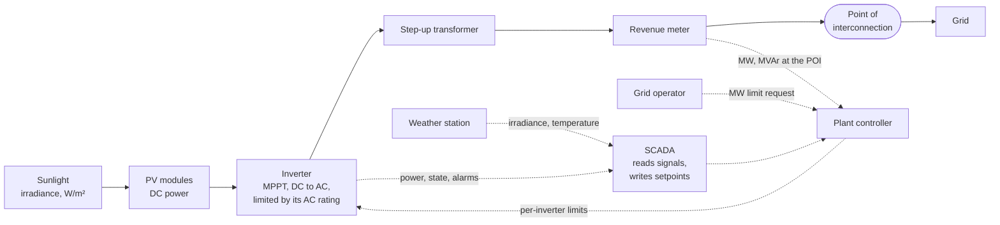

# Solar plant primer, part 1: from sunlight to the grid

Written 2026-10-03. Part 2 (batteries: PCS, BMS, state of charge, dispatch) is written in Phase 2, right before the
BESS model. Every term is explained before it is named; the glossary ([glossary.md](glossary.md)) has the short form.
Source tags like [S4] point to the table at the end, which also says how each source was checked.

## 1. The chain in one picture

Solid arrows carry energy. Dashed arrows carry information. SCADA sits on the dashed side: it watches and commands, but
it does not carry any power.

## 2. Sunlight: how much arrives

The idea: sunlight delivers power over an area, so we measure it in **watts per square meter (W/m²)**. That quantity
is called **irradiance**. Clear midday sun at sea level is roughly 1000 W/m² (general knowledge), and 1000 W/m² is the
reference value used for rating panels (section 3) [S7].

Irradiance is split by where the light comes from:

- **DNI (direct normal irradiance):** light straight from the sun's disc, measured on a surface facing the sun [S4].
- **DHI (diffuse horizontal irradiance):** light scattered by the sky, landing on a flat, level surface [S5].
- **GHI (global horizontal irradiance):** everything landing on a flat, level surface. GHI = DHI + DNI × cos(θz),
  where θz is the zenith angle, the angle between straight up and the sun [S4]. A **pyranometer** measures it.

Panels are not level, so the number that drives a plant is different:

- **POA (plane-of-array irradiance):** what actually lands on the tilted (or tracking) panel face. It adds up the
  direct beam, the sky's diffuse light, and light reflected off the ground [S6].

A common beginner mistake is to read GHI as "the sunlight on the panels". GHI is a weather-station number; **POA is the
one that matters for power**.

## 3. Panels: sunlight to DC

A **PV cell** turns sunlight into electricity directly. One cell makes very little power, so cells are wired into a
**module** (a panel), and modules into an **array** [S13]. Modules are normally wired in series chains called
**strings** (general knowledge; not checked against a source here).

The electricity is **DC (direct current)**: steady, one direction. The grid uses **AC (alternating current)**, so
something must convert it (section 4).

A panel's **nameplate rating** is its output under **standard test conditions (STC)**: 1000 W/m² of irradiance, a
cell temperature of 25 °C, and a standard sunlight spectrum, air mass 1.5 [S7]. Two things follow:

- At the same irradiance, a real panel makes less than its nameplate, because cells in the field run hotter than
  25 °C and output falls as cells heat up. The rate is a number on each module's datasheet.
- To first order, DC power rises in step with POA irradiance. That straight-line relationship is what clipping
  breaks (section 4).

## 4. The inverter: DC to AC

An **inverter** converts DC to AC so the plant can feed the grid [S12]. Three ideas matter for SCADA.

**MPPT.** For any given sunlight, an array's current and voltage trade off along a curve (the **I-V curve**), and one
point on that curve gives the most power: the **maximum power point (MPP)**. **MPPT (maximum power point tracking)** is
the inverter function that keeps the array operating at that point as sun, temperature, and shading change [S8].

**AC rating.** An inverter has a fixed maximum AC output, in kW or MW. Plants are described by their **AC capacity
(MWac)**, the sum of inverter ratings, and their **DC capacity (MWdc)**, the sum of module nameplates.

**ILR and clipping.** The **inverter loading ratio (ILR)**, also called the **DC:AC ratio**, is DC capacity divided by
AC capacity [S3]. Designers build ILRs above 1 on purpose, and the trend has been upward [S1]. On a bright midday the
array can produce more DC power than the inverter can pass; the inverter then holds the array away from its MPP, and
output flattens at the AC rating. That flat-topping is called **clipping**, and it breaks the straight-line link
between irradiance and output [S1]. The 2024 NREL Annual Technology Baseline assumes an ILR of 1.34 [S3].

A worked example (illustrative numbers, not a design): a plant with 5 MWac of inverters and an ILR of 1.34 has about
6.7 MWdc of modules. In weak morning sun the modules produce well below 5 MW and the inverter passes everything. Around
midday the modules could offer more than 5 MW and the inverter caps at 5 MW. A simplified model of this is
`AC power ≈ min(efficiency × DC power, AC rating)`. It is a modeling shortcut, not a specification.

**What an inverter reports.** The SunSpec three-phase inverter model (model 103) is a published list of what a
standards-following inverter exposes over Modbus [S11]. It is 52 registers: an ID, a length (50), and 50 body
registers. Points that matter here:

| Point | Meaning | Type | Unit |
|---|---|---|---|
| `W` | AC power | int16 | W |
| `Hz` | AC frequency | uint16 | Hz |
| `PhVphA`, `PhVphB`, `PhVphC` | AC phase voltages | uint16 | V |
| `WH` | lifetime energy | acc32 (2 registers) | Wh |
| `DCW` | DC power | int16 | W |
| `TmpCab` | cabinet temperature | int16 | °C |
| `St` | operating state | enum16 | |

Most numeric points carry a paired **scale factor** (`W_SF`, `Hz_SF`, and so on): the register holds a whole number
and the scale factor tells you where the decimal point goes. The usual SunSpec rule is real value = register × 10 to
the power of the scale factor (the rule itself is not in the model file I read).

## 5. The plant: transformer, meter, point of interconnection, controller

A plant has many inverters. Their output passes through a **step-up transformer** that raises the voltage for the
grid (general knowledge; not checked against a source here).

**Point of interconnection (POI).** The plant sells and is judged at one place: the point where the plant's
interconnection facilities meet the transmission provider's system [S9]. A **revenue meter** near it measures what is
delivered: active power (MW), reactive power (MVAr), and energy (MWh).

**Active vs reactive power.** *Active power* (watts) does the useful work and is what is sold. *Reactive power* (vars)
swings back and forth without doing work, but it helps hold voltage steady. Inverters can supply or absorb it, and
grid operators use that [S12].

**Plant controller (PPC, power plant controller).** One controller sits above all the inverters. It takes plant-level
targets (an MW limit, a voltage or reactive-power target), measures the result at the POI, and sends commands down to
the inverters; each inverter's own controller acts on those dispatched commands [S10].

**Setpoint.** A target value written by a controller or operator, as opposed to a measurement read from a device. The
SunSpec "immediate controls" model (model 123) shows the pattern for limiting active power: `WMaxLimPct` sets the cap
as a percent of the inverter's maximum, `WMaxLim_Ena` turns the limit on, and `WMaxLimPct_RvrtTms` is a timeout after
which the limit reverts, so a lost command link cannot hold an inverter capped forever [S11].

**Curtailment.** NREL describes curtailment as a variable generator producing less than its technical potential [S2].
The same paper argues that the usual definition is too broad, and proposes reserving the word for available output that
goes unused, rather than output deliberately withheld to provide another grid service [S2]. This project uses the two
words this way:

| | Clipping | Curtailment |
|---|---|---|
| Cause | The inverter reaches its own AC rating | An instruction (grid operator, plant controller setpoint) |
| Who decides | Plant design (the ILR) | An outside party or a control mode |
| Fix | Nothing at runtime | Remove the instruction |

The table is this project's working convention built from [S1] and [S2], not a quotation from either.

## 6. What SCADA sees

An illustrative signal map. The real points list is decided in Phase 1 design, so treat it as a starting sketch.

| Device | Typical signals (read) | Typical commands (write) | Basis |
|---|---|---|---|
| Inverter | AC power, DC power, AC voltage, frequency, energy counter, temperature, state, event flags | Active power limit, limit enable, limit timeout | SunSpec models 103 and 123 [S11] |
| Weather station | GHI, POA irradiance, ambient and module temperature, wind speed | none | General practice (not checked against a source here) |
| Revenue meter at the POI | MW, MVAr, MWh, voltage | none | General practice (not checked against a source here) |
| Plant controller | Current plant limit, mode, status | MW limit, mode | Role from [S10]; signal names not checked |

## 7. Not modeled here

Per the project scope: volt-var and frequency response, string-level behavior, and tracker mechanics. They are real
and matter on real plants (see the grid services in [S12]); the simulator will not reproduce them, and the simulator's
documentation will say so.

## Sources and how each was checked

Checked 2026-10-03. NREL's documents are now served from `nlr.gov`; older `nrel.gov` links did not resolve from this
machine.

| Tag | Source | How checked |
|---|---|---|
| S1 | Anderson et al., "The Effect of Inverter Loading Ratio on Energy Estimate Bias," NREL/CP-5K00-82812, 2022. https://docs.nlr.gov/docs/fy22osti/82812.pdf | Read the PDF text |
| S2 | O'Shaughnessy, Cruce, Xu, "Solar PV Curtailment in Changing Grid and Technological Contexts," NREL/CP-6A20-74176. https://docs.nlr.gov/docs/fy21osti/74176.pdf | Read the PDF text |
| S3 | NREL, Annual Technology Baseline 2024, Utility-Scale PV. https://atb.nlr.gov/electricity/2024/utility-scale_pv | Read the page through a summarizing tool; the 1.34 figure also appeared in a separate search excerpt |
| S4 | Sandia PVPMC, Global Horizontal Irradiance. https://pvpmc.sandia.gov/modeling-guide/1-weather-design-inputs/irradiance-insolation/global-horizontal-irradiance/ | Read the page |
| S5 | Sandia PVPMC, Diffuse Horizontal Irradiance. https://pvpmc.sandia.gov/modeling-guide/1-weather-design-inputs/irradiance-insolation/diffuse-horizontal-irradiance/ | Read the page |
| S6 | Sandia PVPMC, Plane of Array (POA) Irradiance. https://pvpmc.sandia.gov/modeling-guide/1-weather-design-inputs/plane-of-array-poa-irradiance/ | Read the page |
| S7 | King, Boyson, Kratochvil, "Photovoltaic Array Performance Model," SAND2004-3535, 2004. https://www.osti.gov/servlets/purl/919131/ | Read the PDF text (reference conditions: 1000 W/m², 25 °C, air mass 1.5) |
| S8 | Newmiller, Blodgett, Gonzalez, "Performance Test Protocol for Evaluating Inverters Used in Grid-Connected Photovoltaic Systems," SAND2015-4418R. https://www.osti.gov/servlets/purl/1184359 | Read the PDF text (MPP and MPPT definitions) |
| S9 | FERC, Standard Large Generator Interconnection Agreement, Article 1 definitions. https://www.ferc.gov/sites/default/files/2020-04/LGIA.pdf | Read the PDF text |
| S10 | Marthi, Debnath, Pan, "Discrete and Integrated Solutions for Hybrid PV Plants Without Momentary Cessation in Low SCR and High Penetration PE Grids" (ORNL and Hitachi Energy). https://www.osti.gov/servlets/purl/1876294 | Read the PDF text (plant controller role) |
| S11 | SunSpec model definitions 103 and 123. https://github.com/sunspec/models/tree/master/json | Read the raw JSON; register counts and offsets computed from it |
| S12 | US DOE, Solar Integration: Inverters and Grid Services Basics, and Solar Power Electronic Devices. https://www.energy.gov/cmei/systems/solar-integration-inverters-and-grid-services-basics | Read the pages |
| S13 | US DOE, Solar Photovoltaic Cell Basics. https://www.energy.gov/cmei/systems/solar-photovoltaic-cell-basics | Search excerpt only; page not read |

Claims marked "general knowledge" or "general practice" in the text have no source in this table and should be checked
before the repo goes public.
