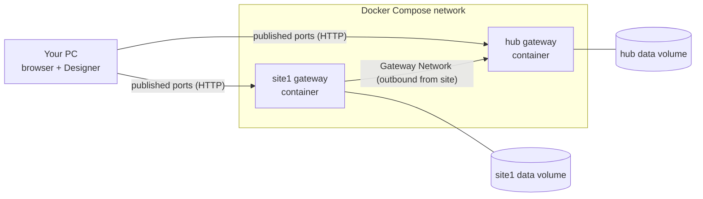

# Layer Card 0: Platform skeleton (containers, gateways, and the network between them)

Status: Phase 0 verified on 2026-10-02 (Ignition 8.3.9 Maker, Docker Desktop on Windows 11).

## Why this layer exists

Everything else in the project (devices, tags, alarms, views) runs inside Ignition gateways. Before building
anything on top, we need to know three things work: gateways run reproducibly in containers, they keep their
state when containers are replaced, and they can talk to each other. If any of these is shaky, every later
phase inherits the problem.

## The pieces and the vocabulary

| Term | What it is here |
|---|---|
| **Image** | `inductiveautomation/ignition:8.3.9`. A read-only template. Pinned (see ADR 0003). |
| **Container** | One running copy of the image. In this project, one container = one Ignition **gateway**. |
| **Gateway** | The Ignition server process. Hosts device connections, tags, projects, alarms, the web UI. |
| **Data directory** | Where a gateway keeps its config and projects. In 8.3 these are plain JSON files, which is what makes Git work. |
| **Volume / bind mount** | Storage that outlives a container. If the data directory is not on one, recreating the container wipes the gateway. |
| **Compose** | `docker-compose.yml` describes all containers, their ports, volumes, and the private network between them. |
| **Gateway Network** | Ignition's own link between gateways. Lets the hub read a site gateway's tags and alarms as remote providers. |
| **Activation** | A Maker license is tied to a gateway. Maker allows 3 active at once, so we protect them (ADR 0002). |

## Shape

## What it owns

- The container definitions, ports, volumes, and network in `docker-compose.yml`
- Gateway admin credentials for local dev (in `.env`, never committed)
- The decision of what lives in Git vs what stays runtime-only (ADR 0003, finalized in Phase 0)

## How it talks to its neighbors

- **You to a gateway:** browser or Designer over HTTP on a published port. Inside the container the gateway listens
  on 8088 (HTTP), 8043 (HTTPS) and 8060 (Gateway Network, SSL). Compose publishes hub on host port 8090 and site1 on 8091.
- **Site gateway to hub:** the site opens an outbound Gateway Network connection to the hub, the same direction a
  real remote site would use. Both ends are provisioned with `GATEWAY_NETWORK_*` environment variables, and the hub
  accepts only gateways on its `SpecifiedList` whitelist, so no manual approval click is needed. Verified in the
  Phase 0 spike: the link reaches **Running** on both sides and survives `down` / `up`. In local dev it runs
  without SSL (ADR 0004) because the SSL link needs the site to trust the hub's self-signed certificate.
- **Gateway to disk:** the data directory on a persistent volume.

## How it fails (and what we do about it)

| Failure | Effect | Defense |
|---|---|---|
| Container recreated without a volume | Gateway state and activation lost; may burn an activation | Named volumes from day one |
| Port collision with your existing Ignition installs (8088 is already used by the DosingControl gateway) | Container fails to start or you open the wrong gateway | Dev containers publish on different host ports |
| Trial expires (2 hours) | Modules stop, gateway and Designer keep running | Reset Trial, or activate Maker |
| Windows line endings in JSON | Phantom Git diffs | `.gitattributes` forces LF |
| Volume wiped while a Maker license was active | New container gets `code=4 License in use` | Regenerate that license's activation token in the account portal before restarting |
| Gateway commissioned with the wrong edition | License rejected ("edition=STANDARD ... valid only for edition=MAKER") | Edition is fixed at first boot; set `IGNITION_EDITION` before the first start, or wipe the volume |
| Repo folder bind-mounted into a brand-new volume | Gateway faults with AccessDenied on `projects/.resources` | Do not bind-mount projects; deploy through the REST API (ADR 0005) |
| Docker Desktop not running (for example after a reboot) | Nothing answers on 8090 / 8091 | Start Docker Desktop; `unless-stopped` containers come back by themselves |

## What Phase 0 proved (2026-10-02)

1. Hub and site gateway start from Compose and survive `down` / `up` with state intact. **Verified.**
2. The site connects to the hub over the Gateway Network and the hub reads a site tag through a remote tag
   provider. **Verified** (plaintext in dev, ADR 0004).
3. Designer edits land as readable files. **Verified.** The repo folder is not bind-mounted, though: projects are
   deployed through the REST API instead (ADR 0005).
4. The 8.3 REST API accepts an API key and can import and export projects and tags, create gateway resources, and
   encrypt secrets. **Verified** on both gateways.
5. Under Maker: Event Streams (Database handler), the SQL Historian, and the Core Historian all work.
   **Verified.** DNP3 is not offered, so it is out of scope.

Full evidence is in [docs/spikes/phase0-findings.md](../spikes/phase0-findings.md).

Teach-back questions for this card are asked at the Phase 0 gate, not listed here.
