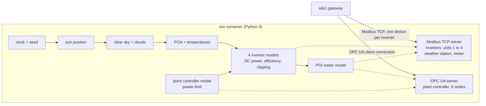

# Layer Card 1: Field devices and the simulator

Status: written 2026-10-03, before the simulator exists. Decisions are in [ADR 0006](../adr/0006-phase1-plant-register-map-and-simulator.md)
and [ADR 0007](../adr/0007-phase1-tag-layout-udt-historian-alarms-plant-controller.md). Domain background is in
[the solar plant primer](../domain/01-solar-plant-primer.md). The "What Phase 1 proves" section stays empty until it is built.

## Why this layer exists

A real solar plant has inverters, a weather station, a revenue meter, and a plant controller on its network. This
project has none of them, so one program stands in for all of them. The gateways must not be able to tell the
difference in how they talk to it: they poll Modbus registers and an OPC UA server exactly as they would at a real
site. What the simulator does not copy is physics that real equipment does and ours skips, so the card labels every
behavior as one of three things:

- **Modeled:** a published equation used as published.
- **Approximated:** a published model with simplifications, or a plain design choice with no published basis.
- **Not modeled:** left out, and said so.

## The pieces and the vocabulary

| Term | What it is here |
|---|---|
| **Simulator** | One Python 3 program in a Compose service named `sim` (ADR 0006). It produces the same numbers a plant would, on a clock. |
| **Modbus TCP server** | The part of the simulator the gateways poll. A Modbus **register** is a 16-bit slot at a numbered address. |
| **Unit ID** | A number inside the Modbus request that picks which device answers when several share one endpoint. Inverters use units 1 to 4. |
| **SunSpec model 103 / 123** | The public register layouts for a three-phase inverter and its power-limit controls (ADR 0006). |
| **Scale factor** | A paired register that says where the decimal point goes: real value = register x 10^SF. |
| **OPC UA server** | The part of the simulator that exposes the plant controller as named nodes (ADR 0007). |
| **Seed** | A number that makes the random parts (clouds, noise) repeat exactly from run to run. |

## Shape

## What it owns

- The physics chain below, run on a real-time clock (with a start-time option) and a seed.
- The Modbus register layout: four inverters on units 1 to 4 (SunSpec model 103 plus the model 123 power-limit points,
  which are read-only mirrors in Phase 1), the weather station on unit 5 (models 302, 303, 307), and the POI meter on
  unit 6 (model 203). Details are in [ADR 0009](../adr/0009-phase1-weather-meter-layouts-unit-ids-inverter-details.md)
  and the generated [register map](../points/site1-register-map.md).
- The six plant controller nodes: `ActivePowerLimit_MW` and `LimitEnable` (write), `LimitActive`, `POI_MW`, `Status`, and
  `RatedMW` (read; the plant's AC rating, added in Phase 2 as the scale for the limit).
- Enforcing an accepted power limit by capping inverter output, so curtailment shows up in the data.

## The physics chain

The simulated site is an illustrative west-Texas location (about 31.0°N, 102.0°W, Central time), with fixed-tilt
panels facing south at a tilt near the latitude ([ADR 0008](../adr/0008-phase1-simulated-site-orientation-clouds-signals.md)).
Each step names its source; the source table at the end says how each was checked.

| Step | Model | Label |
|---|---|---|
| 1. Sun position | NOAA solar position equations: fractional year, equation of time, declination, solar time, hour angle, zenith [L1]. The sim uses the UTC clock, so daylight saving never enters. | Approximated: geometric zenith, no refraction correction |
| 2. Clear-sky irradiance | Haurwitz: GHI = 1098 x cos(z) x exp(-0.059 / cos(z)), zero when the sun is down [L2] | Approximated: depends on zenith only, no air quality or altitude |
| 3. Clouds | A seeded random factor that dims clear-sky GHI | Approximated: a design choice with no published basis |
| 4. Split into beam and diffuse | Erbs: clearness index, then diffuse fraction in three pieces (linear up to 0.22, a degree-4 polynomial to 0.8, then 0.165), then DHI = fraction x GHI and DNI = (GHI - DHI) / cos(z) [L3] | Approximated |
| 5. Irradiance on the panel (POA) | Beam = DNI x cos(angle of incidence); sky diffuse = DHI x (1 + cos(tilt)) / 2; ground reflection = GHI x albedo x (1 - cos(tilt)) / 2 [L4] | Approximated: the simplest sky model; no shading, soiling, or angle-of-incidence loss |
| 6. Module temperature | Ross: T = T_ambient + (NOCT - 20) / 800 x POA, POA in W/m² [L5]. Ambient temperature follows a simple daily curve plus noise. | Approximated: wind is not modeled; the ambient curve is a design choice |
| 7. DC power of one inverter's modules | PVWatts: P_dc = (POA / 1000) x P_dc0 x (1 + gamma x (T_cell - 25)), with gamma inside the documented range of -0.002 to -0.005 per °C [L6] | Modeled; the gamma value is chosen when built |
| 8. Inverter AC power and clipping | PVWatts inverter: efficiency = (eta_nom / eta_ref) x (-0.0162 x z - 0.0059 / z + 0.9858) with z = P_dc / P_dc,limit; P_ac = min(efficiency x P_dc, P_ac0); P_ac0 = eta_nom x P_dc,limit [L6]. Defaults eta_nom = 0.96, eta_ref = 0.9637. | Modeled for clipping; Approximated for efficiency (a generic curve, not a real unit's) |
| 9. Plant controller limit | An accepted MW limit becomes a per-inverter cap, applied immediately | Approximated: no ramp rate, no reversion timeout (both exist in SunSpec model 123) |
| 10. POI meter | POI MW = sum of inverter AC power; MWh is its integral; voltage near nominal with noise | Approximated: no transformer or collection losses |
| 11. Noise and dead time | Small seeded noise on readings; a short delay before a setpoint takes effect | Approximated: design choices |

Not modeled, documented as such: reactive power (unity power factor), volt-var and frequency response, string-level
behavior, tracker mechanics, wind, shading and soiling, degradation. The ILR of 1.34 means each 1.25 MWac inverter has
1.675 MWdc of modules behind it (illustrative numbers, ADR 0006).

## How it talks to its neighbors

- **Gateway to simulator:** site1 opens Modbus TCP connections to the `sim` service by name, one Modbus device per
  inverter, with the unit ID inside each tag address (finding 13). A separate OPC UA client connection reads and writes
  the plant controller nodes. Modbus is on port 15020 and OPC UA on 14840 (ADR 0010); port 5020 is taken by the
  native DosingControl gateway (CLAUDE.md). The simulator runs as the `sim` container (ADR 0013), so the gateway reaches
  it as `sim:15020` and `sim:14840` on the Compose network, the same way it reaches `postgres:5432`.
- **Simulator to gateway:** it never calls the gateway. It only answers.
- **Clock:** real time by default, so gateway timestamps and simulator time agree; an accelerated mode is demo-only
  (ADR 0006).

## How it fails (and what we do about it)

| Failure | Effect | Defense |
|---|---|---|
| Simulator not running | Device connections fault and tags go bad quality | The `sim` service will use `restart: unless-stopped`, like the gateways; the gateway shows a faulted device meanwhile |
| Port collision on the PC | Another program answers or the server will not start | Do not publish simulator ports to the PC; the gateways reach it by service name |
| Register map drifts from the UDT | Tags read the wrong registers | One source of truth, the points list (D9); in Phase 1 the two are kept in step by hand and checked by the scale-factor test |
| Negative scale factor stored wrongly | Values off by orders of magnitude | The map stores scale factors as signed 16-bit values; the spike showed 0xFFFF reads as -1 (finding 13) |
| Read of an unmapped address | A real device would refuse it | The simulator answers with a Modbus "illegal data address" exception, unlike the spike server, which returned zeros |
| Real-time runs differ by start time | Hard to repeat a test | Seed plus the start-time option make a run repeatable |

## What Phase 1 proves

To be filled in when the simulator and Site 1 are built and checked.

## Sources and how each was checked

| Tag | Source | How checked |
|---|---|---|
| L1 | NOAA Global Monitoring Laboratory, "General Solar Position Calculations". https://gml.noaa.gov/grad/solcalc/solareqns.PDF | Read the PDF text |
| L2 | Haurwitz clear-sky model as implemented in pvlib (`pvlib.clearsky.haurwitz`), citing Haurwitz 1945 and 1946 and Reno, Hansen, and Stein, SAND2012-2389. https://github.com/pvlib/pvlib-python | Read the pvlib source code; the original papers were not read |
| L3 | Erbs decomposition as implemented in pvlib (`pvlib.irradiance.erbs`). https://github.com/pvlib/pvlib-python | Read the pvlib source code; the original paper was not read |
| L4 | Sandia PVPMC, Isotropic Sky Diffuse Model; beam and ground-reflected terms from pvlib (`beam_component`, `get_ground_diffuse`). https://pvpmc.sandia.gov/ | Read the PVPMC page and the pvlib source code |
| L5 | Ross cell temperature model as implemented in pvlib (`pvlib.temperature.ross`). https://github.com/pvlib/pvlib-python | Read the pvlib source code; the documentation page writes the divisor as 80 for irradiance in mW/cm², and the code converts from W/m² |
| L6 | pvlib documentation for the PVWatts DC model (`pvlib.pvsystem.pvwatts_dc`) and inverter model (`pvlib.inverter.pvwatts`). https://pvlib-python.readthedocs.io/ | Read the documentation pages |

Two points were corrected while writing: a search summary gave the Haurwitz constant as 0.057 and the source code says
0.059, and the Ross documentation page writes the divisor as 80 where the code, working from W/m², effectively uses 800.

Teach-back questions for this card are asked at the Phase 1 gate, not listed here.
