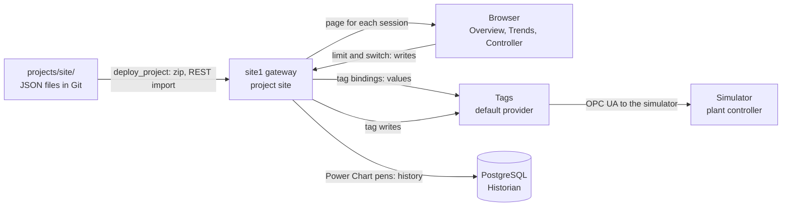

# Layer Card 2: Site 1 views

Status: written 2026-10-05, after the first version was built and checked. Decisions are in
[ADR 0012](../adr/0012-phase1-site-views-as-project-files.md); the history it reads is in
[ADR 0011](../adr/0011-phase1-historian-database-connection-and-sampling.md). Evidence is findings 29 to 33 in
[the Phase 1 findings](../spikes/phase1-findings.md).

## Why this layer exists

Tags and history are useful only if a person can see them. This layer is what an operator opens in a browser: the plant at a
glance, a trend, and the plant controller's limit. It owns no data. Every number on a page is read from a tag or from the
historian, and the one thing a page changes, the power limit, is written back into a tag.

## The pieces and the vocabulary

| Term | What it is here |
|---|---|
| **Project** | A folder of resources that one gateway runs. This one is `site`, kept in the repo at `projects/site/`. |
| **View** | One screen or part of a screen, stored as a `view.json` file. Pages show views, and a view can embed other views. |
| **Page** | A web address inside the project (`/`, `/trends`, `/controller`) that shows one view. The list is `page-config/config.json`. |
| **Component** | A thing on a view, such as a label, a number field, or a chart. Its type name looks like `ia.display.label`. |
| **Binding** | A rule that fills a component property from somewhere else: a tag, an expression, or another property. |
| **Parameter** | A value an embedding view hands to an embedded one, such as which inverter a card shows. |
| **Indirect binding** | A tag binding whose path has a placeholder, like `Inverters/{inverter}/State`, filled from a parameter. |
| **Flex repeater** | A component that shows one view once for each item in a list. The four inverter cards are one view and four list items. |
| **Power Chart** | The trend component. Each line is a pen whose source is a tag path; it asks the historian for the past. |
| **Session** | One person's open browser tab. The gateway builds the page for it and keeps it updated. |

## Shape

## How a view finds its data

1. **Live values.** A label's text is bound to an expression such as
   `numberFormat({[default]Meter/POI_MW}, '0.00') + ' MW'`. The gateway subscribes to that tag for the session and pushes each
   change to the browser. `[default]` is the tag provider, the same name on every site gateway (D25).
2. **Per-inverter cards.** `InverterCard` has a parameter `inverter`. Its custom properties are bound to
   `[default]Inverters/{inverter}/ACPower_kW` and the like, with `{inverter}` filled from the parameter. The repeater's list is
   not typed in: a script transform browses the tags under `[default]Inverters` when the page loads and returns one entry for
   each inverter instance, so the same project gives four cards on a four-inverter site and six on a six-inverter one (Phase 2
   finding 52). The Trends pens and the header (the gateway's own name, from `[System]Gateway/SystemName`) work the same way, and
   the Controller's limit range comes from the plant controller's `RatedMW` node.
3. **History.** The Power Chart pens name tags. For a tag with history on, the chart asks that tag's storage provider
   (`Historian`) for the last 30 minutes, then keeps adding live points.
4. **Writes.** The numeric field and the switch on the Controller page are bound in both directions to
   `ActivePowerLimit_MW` and `LimitEnable`. Editing them writes the tag; the tag writes to the simulator over OPC UA; the
   read-backs (`LimitActive`, `Status`, the plant output) come back through the same bindings.

## How it deploys

`python -m generator.deploy_project site1 projects/site --overwrite` zips the folder, sends it to
`/data/api/v1/projects/import/site`, and asks for a scan. There is no Designer step. The repo is the source of truth; a
change made in Designer would be lost at the next deploy.

## How it fails (and what we do about it)

| What you see | Likely cause | Where to look |
|---|---|---|
| A component is blank | A binding failed to start | `docker.exe compose logs site1`; the page itself says nothing |
| A card shows the default instead of its own data | The embedded view does not declare the parameter as an input | The view's `propConfig`, `paramDirection` (finding 31) |
| Values frozen or `Bad` | The simulator is stopped or a device is down | The simulator terminal; the gateway's device status |
| A trend is empty for a tag | History is not enabled on that tag, or the historian is down | The UDT's history settings; the `fleetdb` connection |
| A page asks for nothing but covers the screen | The Maker personal-use notice | A person clicks Agree and Close |

## What it does not model or protect

No login and no per-user permissions (dev only, ADR 0012). No alarms yet (Phase 3). No hub or multi-site view (Phase 2). The
trend shows only the three logged signals.
