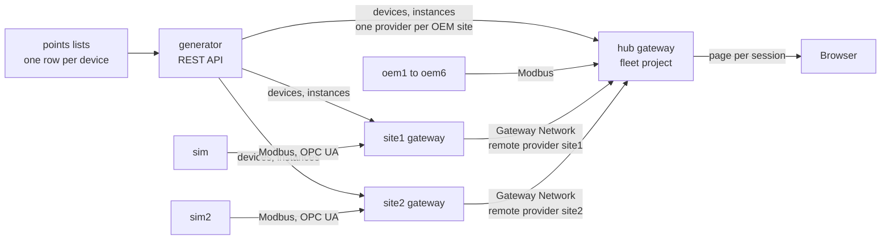
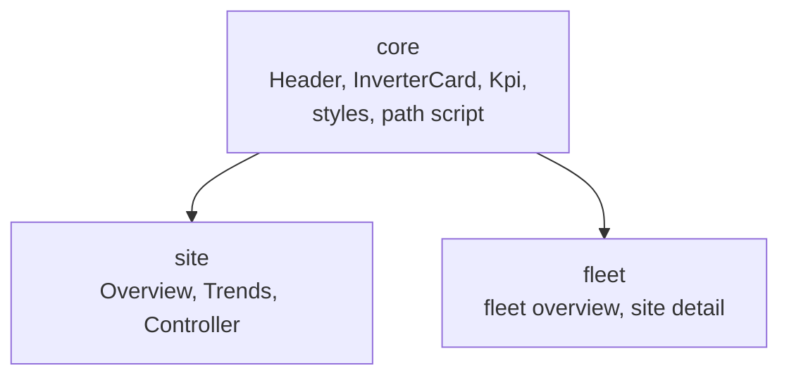

# Layer Card 3: Fleet and templating

Status: written 2026-10-06, **before the build**. It describes the design settled in
[ADR 0014](../adr/0014-phase2-fleet-shape-simulators-oem-reads-inheritance-battery.md), so each claim says whether it is built,
planned, or still to verify. Phase 1 evidence is in [the Phase 1 findings](../spikes/phase1-findings.md); the layer below this one
is [Layer Card 1](01-field-devices-and-simulator.md) and the one beside it is [Layer Card 2](02-site-views.md).

## Why this layer exists

One site is a build. Eight sites is a system, and it only stays manageable if a site is data and not hand work. This layer turns
a short points list into a running fleet: devices and tags on each gateway, a hub that sees every site, and projects written
once and inherited by all. It owns the points list, the generator, the tag providers on the hub, and the project structure. It
owns no plant data of its own; every number still comes from a device.

## The pieces and the vocabulary

| Term | What it is here |
|---|---|
| **Fleet** | All eight sites together. |
| **Site gateway** | An Ignition gateway that runs one plant next to its equipment: `site1` and, in this phase, `site2`. |
| **Hub** | The gateway that sees the whole fleet: fleet views, and later the enterprise links. |
| **OEM-integrated site** | A plant whose own equipment vendor runs the on-site control system. The owner's hub reads its data directly. Six of the eight sites, `oem1` to `oem6`. Here they are simulated and read over Modbus (an approximation, ADR 0014). |
| **Points list** | A CSV with one row per device, not per tag: site, device, kind, unit ID, host, port, rating. `points/site1.csv` is the first. |
| **Generator** | The Python 3 tooling in `generator/` that reads the points list and builds devices and tag instances through the REST API. It reports differences and never overwrites hand-built objects. |
| **UDT and instance** | A UDT is the template for one kind of thing (an inverter); an instance is one real inverter. The template takes **parameters** such as the unit ID, so one definition serves every site. |
| **Tag provider** | A named collection of tags on a gateway, written `[name]` at the start of a path. Every site gateway's own tags are in `[default]`. |
| **Remote tag provider** | A provider on the hub that points at another gateway's provider. The hub holds no copy; it asks the site. |
| **Realtime tag provider (hub's own)** | A provider whose tags the hub itself reads from its own devices. The OEM sites use one each. |
| **Project inheritance** | A child project reuses the views, scripts, and styles of a parent project, so shared pieces exist once. |
| **BESS, PCS, SoC** | A battery energy storage system; its power conversion system (the battery's inverter); and its state of charge (how full it is, as a percentage). Primer part 2 defines them properly before the model is built. |

## Shape

## What exists today and what is planned

| Piece | State |
|---|---|
| Points list, `apply`, `export_types`, `connections`, `deploy_project`, `retarget` | Built (Phase 1) |
| Site 1, the Gateway Network link to the hub (site1 on the hub's whitelist) | Built |
| UDT import (`generator.import_types`) | Built 2026-10-06; tried on a scratch provider (findings 42 to 44) |
| PlantController connection and instance (a `plantcontroller` row; `generator.apply`) and the `Historian` provider (`generator.connections`) | Built 2026-10-06; tried on scratch objects (findings 45 to 47) and reported unchanged against site1 |
| The whole rebuild run in sequence on an empty gateway | Done on site2, 2026-10-06 (finding 51) |
| Site 2 files: `site2` and `sim2` in compose, `points/site2.csv`, `.env.example` names, a fleet consistency test | Built and running 2026-10-06 |
| `site2` gateway running (license, `.env` values, API level and key, hub whitelist) | Running 2026-10-06; devices, types, instances, historian, and the hub's remote provider built by the generator (finding 51) |
| Remote tag provider `site1` on the hub | Built by hand 2026-10-06; REST creation of a remote provider works (findings 36 to 38) |
| Remote tag provider `site2` on the hub | Built by `generator.providers` 2026-10-06 (finding 50) |
| The `site` project, unchanged, on both site gateways (inverter list from a tag browse, header from the system name) | Built 2026-10-06 (finding 52) |
| `core`, `site`, `fleet` projects with inheritance; `generator.deploy_all` | Built 2026-10-06 (finding 56) |
| The hub's fleet overview: every site through its remote provider, the site list found by browsing the providers | Built 2026-10-06 (finding 57) |
| OEM site `oem1`: simulator service, points file, generator mapping to the hub, local provider (ADR 0015) | Built and live 2026-10-06 (finding 59) |
| OEM sites `oem2` to `oem6` | Built and live 2026-10-06 (findings 60 and 61); eight sites are live from their points lists |
| Battery model | Planned, after primer part 2 |
| Simulator plant shape from `--inverters`, `--inverter-kw`, `--seed` or `SIM_INVERTERS`, `SIM_INVERTER_KW`, `SIM_SEED`, with unit IDs by inverter count | Built 2026-10-06 (tests, and a 6-inverter run read over Modbus); the `sim2` container that uses it is still planned |

## How a site is made from a row

1. A row such as `site1,Inv3,inverter,3,sim,15020,1250` says which device, which unit ID, where the simulator is, and its rating.
2. The generator creates the Modbus device first and waits until it is healthy, then creates the instance of the Inverter UDT
   with that unit ID and rating as parameters. Devices come first because a tag that subscribes before its device is healthy can
   stay on `Bad_NodeIdUnknown` until restarted (finding 26).
3. It compares what is on the gateway with the list and reports differences. It does not repair or delete them.
4. A new site is a new points file. Site 2 differs from Site 1 in rows (six inverters), not in tooling.
5. For an OEM site the target changes: the devices go on the hub, and the tags go in a provider named for the site. That is a
   new generator rule, the `site` column mapping to a gateway and a provider (planned).

## How the hub sees the fleet

1. **Site gateways.** The site dials the hub over the Gateway Network, and the hub accepts only gateways on its whitelist
   (`GATEWAY_NETWORK_WHITELIST: site1,site2`). That check is separate from SSL, which is off locally (ADR 0004).
2. **Remote providers.** On the hub, `site1` points at site1's `default` provider. Site 1's inverter power is
   `[site1]Inverters/Inv1/ACPower_kW`; the hub holds nothing (the hub's disk has no `site1` tag folder, finding 37). The hub's
   name differs from the site's `default` (finding 36). The REST tag export does not follow a remote provider (finding 39), so a
   remote tag's value is checked in Designer or a session.
3. **OEM sites.** The hub's own Modbus devices read the plants directly, and each plant's tags sit in a provider such as `oem3`,
   so the path shape matches. The REST API can create a remote provider (finding 38). To verify: that it can create the
   `STANDARD` providers the OEM sites need, and that Maker allows six.
4. **Fleet views.** A view takes a site ID and builds the path, the same idea as the InverterCard's `{inverter}` placeholder:
   an indirect tag binding such as `[{site}]Meter/POI_MW` fills the provider name (finding 57). The list of sites is the hub's
   own tag providers minus `System` and `default`, found by a tag browse, so a new site or OEM provider shows up by itself.

## How projects are shared

`core` is marked inheritable; `site` and `fleet` name it as their parent in `project.json`. Each gateway holds `core` and its own
child: site gateways get `site`, the hub gets `fleet`. A child runs only when its parent is on the same gateway (finding 56), so
`generator.deploy_all` puts `core` first on every gateway. Changing an existing project's parent needs `--recreate` (the old
project is renamed aside, never deleted), because an overwrite leaves the running copy blind to the new parent's views. The repo
copy is still the source of truth, so a deploy with `--overwrite` replaces Designer edits (Layer Card 2).

## How it fails (and what we do about it)

These are expected failures from the design, not yet observed.

| What you see | Likely cause | Where to look |
|---|---|---|
| A site's provider is missing or bad on the hub | The Gateway Network link is down, or the site is not on the whitelist | Hub Gateway Network page; `GATEWAY_NETWORK_WHITELIST` |
| A new gateway starts with `code=4 License in use` | A leftover lease after a volume wipe | Regenerate that license's token in the account portal |
| A device faults on a new site | The simulator for that site is not running, or the `host` in the points list is wrong | `docker.exe compose ps`; the points file |
| Fewer inverters than the points list, or the simulator errors | The plant shape in the simulator's settings disagrees with the points list (the unit IDs follow the inverter count, so a wrong count shifts the weather station and meter) | The simulator's environment settings; the first line of its log, which names the units and the inverter count |
| Tags stay on `Bad_NodeIdUnknown` | They subscribed before the device was healthy | Restart Tag in Designer |
| A child project has blank pages or missing views | The parent project is not on that gateway | The gateway's project list |
| A fleet view shows the wrong site | The site ID parameter or path is wrong | The view's bindings |

## What it does not model or protect

No alarms or downtime handling (Phase 3). The OEM sites are read over Modbus, which approximates how an owner receives vendor
data. The battery is a simplified AC-coupled model with no temperature, degradation, or automatic dispatch (ADR 0014). The
Gateway Network is plaintext and the simulators have no security, as in Phase 1. There is no per-user access control on the
fleet views.
